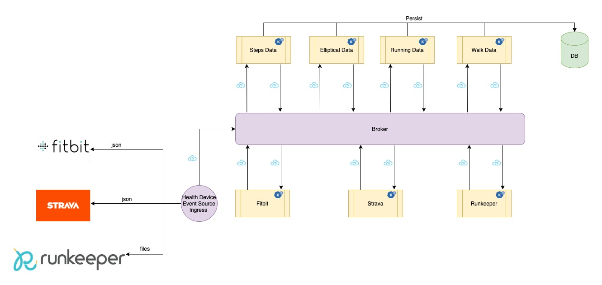
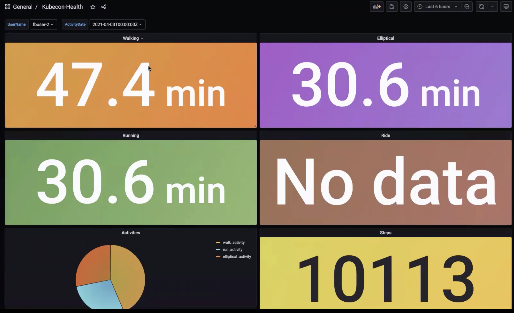

# Health Device Data aggregation with Cloud Events and Knative Eventing

This repo was developed for the demo at kubecon Europe 2021.

Talk : [Event Processing at Optum, the cloud events way](https://youtu.be/gXuW9mvj6xM)

### Use Case

Processing data from various health devices into a common format using cloud events and knative



### Pre Req

To run this app you need the below

* Knative Serving and Eventing

### Install Mysql and Grafana

```
kubectl create ns kubecon

kubectl apply -f config/mysql.yaml

# see the steps in config/mysql.md to configure mysql

kubectl apply -f config/grafana.yaml
```

Create the datasource in grafana and connect to mysql

Import the dashboard from config/grafana-dashboard.yaml

### Deploy Knative Artifacts

```
kubectl apply -f config/rb.yaml

kubectl apply -Rf serving/

kubectl apply -Rf eventing/
```

### Triggering the flow

```
export KN_DOMAIN = <your kn domain>

curl "http://health-data-ingest-kubecon.${KN_DOMAIN}/?labels=app=health-data-ingest&DEVICE_TYPE=STRAVA&history=0"

curl "http://health-data-ingest-kubecon.${KN_DOMAIN}/?labels=app=health-data-ingest&ACT_DATE=2021-04-03&DEVICE_TYPE=FITBIT&history=0"

curl "http://health-data-ingest-kubecon.${KN_DOMAIN}/?labels=app=health-data-ingest&DEVICE_TYPE=RUNKEEPER&history=0"
```

### Dashboard




